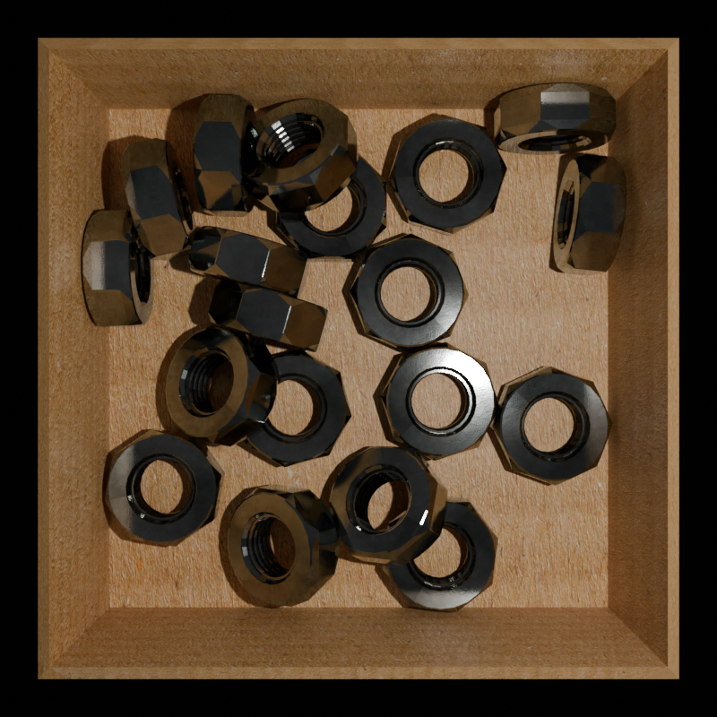
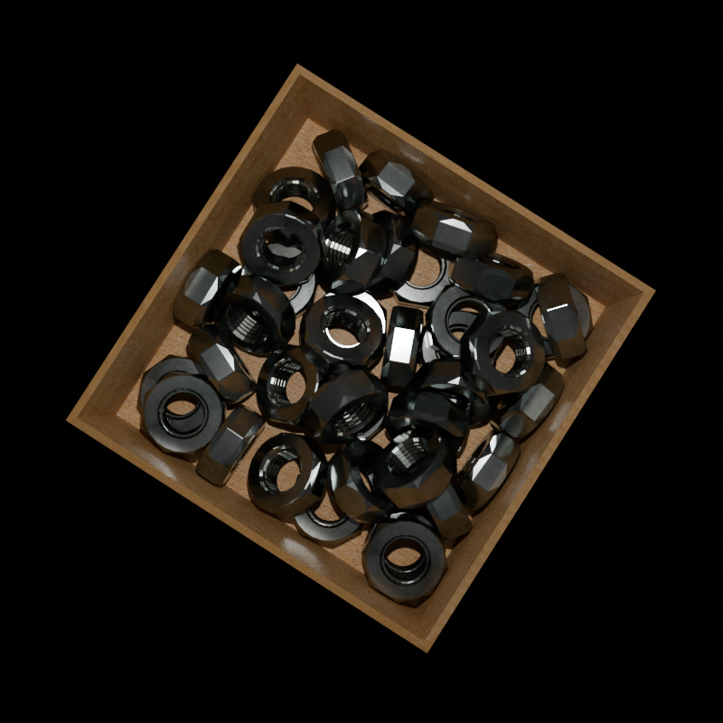

# Synthetic Dataset: Metal Nuts Randomly Scattered in a Box

## Description
This synthetic dataset aims to address the problem of detecting metal nuts randomly scattered in a box, particularly focusing on identifying nuts that lie relatively flat. The dataset is designed to aid in the development and evaluation of algorithms for automated nut detection in industrial settings.

## Example samples from the dataset
*Example image 1*

*Example Mask 1*

*Example image 2*

*Example Mask 2*

## Method of creating the dataset

In Blender, I use Python scripts you can find in the repository to create an array of copies of objects, in my case metal nuts. These copies are randomly positioned above a background, in my case a cardboard box. Then, I use the built-in physics engine to simulate the nuts falling into the box and settling into place.

Next, I randomly set the position and power of the light source, and I also randomly position the camera. In this particular case the camera's rotation always points it towards the center of the scene (0,0,0).

After setting up the scene, I identify which objects are visible using ray casting to points on the object. In my cas, visible objects are those not obscured by others and lying within a certain angle threshold.

I render the scene as it is and also render a cryptomatte pass, which captures the masks only for the visible objects.

Finally, I record the total number of objects in the scene and the number of visible objects in a CSV file. I repeat this process for as many iterations as needed to create my custom dataset.

The output is .png raw images and .exr masks

If you toggle system console in blender, you can also see prints of how much time has passed and estimated time to copletion
